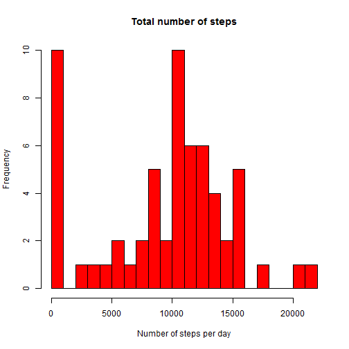
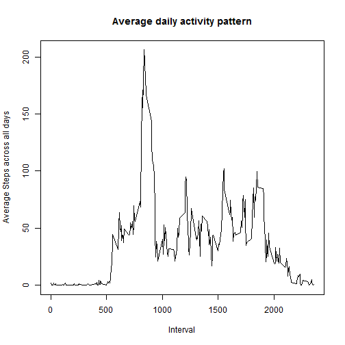
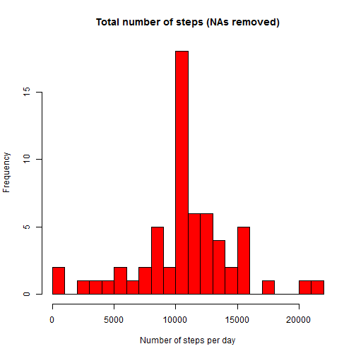
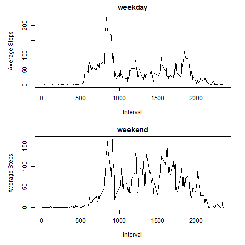

Reproducible Research: Peer Assessment 1
========================================

Loading and preprocessing the data
----------------------------------

The file is read


```r
data <- read.csv("activity.csv")
```

Total number of steps is calculated


```r
total_steps<-tapply(data$steps, data$date, FUN=sum, na.rm=TRUE)
```

What is mean total number of steps taken per day?
-------------------------------------------------

This code generates a histogram for the total number of steps taken per day. 20 breaks are taken in order to give some detail


```r
hist(total_steps, col="red", main="Total number of steps", xlab="Number of steps per day", ylab="Frequency", breaks=20)
```

 

mean value is calculated for the number of steps taken each day

```r
mean_steps<- as.integer(mean(total_steps))
```
The mean is ``9354`` steps per day.

median value is calculated for the number of steps taken each day

```r
median_steps<- median(total_steps)
```

The median is ``10395`` steps per day.

What is the average daily activity pattern?
-------------------------------------------

Time series plot with the average number of steps taken and averaged across all days


```r
steps_interval <- aggregate(steps ~ interval, data, mean)
plot(steps_interval$steps ~ steps_interval$interval, type = "l", main = "Average daily activity pattern", xlab = "Interval", ylab = "Average Steps across all days")
```

 

We look for the maximum number of steps across steps_interval


```r
max_interval<-(steps_interval$steps==max(steps_interval$steps))
max_steps<-steps_interval[max_interval,1]
```
The interval with the maximum number of steps is ``835`` and the related number of steps is ``206.169811320755``

Imputing missing values
-----------------------


```r
sum_NAs<-sum(is.na(data$steps))
```

There are ``2304`` NAs within the data

I will create a new data set in which all NA values for "steps" will be substituted with the "steps" mean from each interval across all days

New data set


```r
data_without_NAs <- data
```

Algorithm to remove NAs and place mean values of steps for each 5-minutes interval across all days


```r
for(i in 1:nrow(data)) 
  {
    if (is.na(data$steps[i]))
          { 
           ind_steps_interval<-which(steps_interval$interval==data$interval[i])
           data_without_NAs$steps[i]<- steps_interval$steps[ind_steps_interval]
           }
  }
```

Within the new data set, I calculate again the number of total steps per day to plot the histogram

```r
total_steps_no_NAs<-tapply(data_without_NAs $steps, data_without_NAs $date, FUN=sum)
```

I plot the new histogram


```r
hist(total_steps_no_NAs, col="red", main="Total number of steps (NAs removed)", xlab="Number of steps per day", ylab="Frequency", breaks=20)
```

 

mean value is calculated for the number of steps taken each day


```r
mean_steps_no_NAs<- as.integer(mean(total_steps_no_NAs))
```
mean value is ``10766``

median value is calculated for the number of steps taken each day


```r
median_steps_no_NAs<- median(total_steps_no_NAs)
```

median value is ``10766.1886792453``

The mean and median are now equal to ``10766``. When we were considering NAs for some "steps" values, both mean and median were lower because NAs were considered as 0. Now we have imputed mean "steps" values to substitute those NAs (previously considered as 0s when computing the total mean). As we are substituting O by higher numbers, the resulting mean and median are higher now.


Are there differences in activity patterns between weekdays and weekends?
--------------------------------------------------------------------------

From the column "date", and using the function "weekdays", I get an additional column for the data set that contains the days of the week. In my case, this is done is Spanish


```r
data_without_NAs$day <- weekdays(as.Date(data_without_NAs$date))
```

I classify Saturdays and Sundays as weekend days and the rest as weekday ones


```r
for(i in 1:nrow(data_without_NAs)) {
  if(data_without_NAs$day[i]=="sábado") {
     data_without_NAs$day[i]<-"weekend"
  }
     else if(data_without_NAs$day[i]=="domingo") {
       data_without_NAs$day[i]<-"weekend"
  }
        else data_without_NAs$day[i]<-"weekday"
}
```

So far, this column is class "character". I turn it into factor, following the instructions from the assignment


```r
data_without_NAs$day<-as.factor(data_without_NAs$day)
```

I separate weekdays and weekends in 2 subsets previous to building the related plots


```r
data_weekday <- subset(data_without_NAs, day == "weekday")
data_weekend <- subset(data_without_NAs, day == "weekend")
```

I calculate the steps mean for every 5-minutes interval across all the days, both for weekends and for weekdays


```r
steps_interval_weekday <- aggregate(steps ~ interval, data_weekday, mean)
steps_interval_weekend <- aggregate(steps ~ interval, data_weekend, mean)
```

I plot both graphs


```r
par(mfrow = c(2, 1), ps = 12, mar = c(5, 5, 2, 2))
plot(steps_interval_weekday$steps ~ steps_interval_weekday$interval, 
    type = "l", main = "weekday", xlab = "Interval", ylab = "Average Steps")
plot(steps_interval_weekend$steps ~ steps_interval_weekend$interval, 
    type = "l", main = "weekend", xlab = "Interval", ylab = "Average Steps")
```

 

From the plots we can see there are differences in activity patterns when comparing weekdays to weekends.
